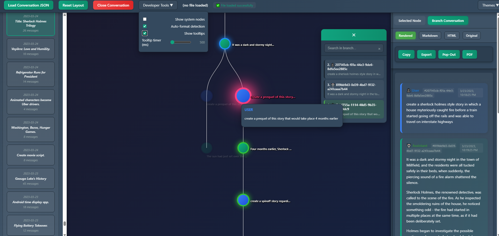

# 📁 ChatGPT and DeepSeek JSON Tree Viewer
*A standalone HTML tool for exploring, converting, and visualizing AI chat exports as interactive branching trees.*

<br>

## 📌 Overview
ChatGPT and DeepSeek JSON Tree Viewer is a **single-file HTML application** that loads AI conversation exports and renders them as an **interactive branching tree**.
It supports **multiple data formats**, auto-detects and converts them, and allows you to inspect every message, branch, and node with clarity.

This viewer is ideal for anyone who wants to explore large or complex chat histories in a structured, visual way.

This repository contains the full-featured UI defined in **chatgpt-json-tree-viewer.html**. 

## 🚀 Features

### 🔍 **Multi-format Support**
The viewer automatically recognizes and converts:
- **ChatGPT multiverse JSON**
- **ChatGPT conversations.json** (multiple conversations)
- **DeepSeek Chat Exporter JSON**

Auto-conversion handles:
- Node mapping
- Roles
- Message extraction
- Content sanitization
- Linear or branching mapping reconstruction

### 🌳 **Interactive Tree Visualization**
- Adjustable zoom and pan
- Drag nodes to reposition branches
- Colored nodes per role (User, Assistant, System)
- Tooltips with previews
- Auto-centering on selected nodes

### 🧭 **Conversation Explorer**
- Left sidebar displays all conversations in conversations.json
- Search across all conversations
- Match counters per conversation
- Click to switch between conversations instantly

### 📑 **Right Panel Message Viewer**
Tabbed display:
- Rendered (Markdown → HTML)
- Raw Markdown
- HTML source
- Original JSON fragment

Includes:
- Copy button
- Export to file
- Pop-out window
- PDF generation

### 🧩 **Branch Explorer Sidebar**
- Automatically indexes all messages in a selected branch
- Mini search bar for branch-local search
- Click an index item to jump to that message

### 🗺️ **Minimap**
- Live-updating navigator
- Shows your viewport rectangle
- Great for large trees

### 🛠️ **Developer Tools Menu**
- Toggle system nodes
- Toggle auto-format detection

### 🧲 **Drag-resizable Layout**
- Resize left sidebar
- Resize right viewer panel

---

## 📷 Screenshots



---

## 📥 Installation
No installation required.

Just download the HTML file and open it in any modern browser:

```
chatgpt-json-tree-viewer.html
```

Everything runs **100 percent locally** in your browser. No servers. No uploads.

---

## 📘 Usage Guide

### **1. Load a JSON file**
Click the **"Load Conversation JSON"** button.
You may also *drag and drop* a JSON file onto that button.

Supported file types:
- ChatGPT multiverse JSON
- conversations.json
- DeepSeek Chat Exporter JSON

If the format is unknown, the app will display an error message.

---

### **2. Explore the conversation tree**
Once loaded:
- The central canvas shows the branching structure
- Zoom with mouse wheel
- Pan by dragging empty canvas
- Drag nodes to reposition

Hover a node to see a tooltip.
Click a node to open its message in the right viewer panel.

---

### **3. Search messages**
#### Global search
Use the **Search Messages** section in the left sidebar.

Results show:
- Conversation where match occurred
- Role
- Preview text

Click a result to jump to that node, even if it’s in a different conversation.

#### Branch search
Open the **Branch Conversation** tab and use the search box inside the Branch Index sidebar.

---

### **4. View and export messages**
When a node is selected, choose how to view the content:
- Rendered Markdown
- Original JSON
- Raw Markdown
- Raw HTML

Use the toolbar buttons:
- **Copy**
- **Export file**
- **Pop-out window**
- **PDF**

---

### **5. Switch between conversations**
If you load a **conversations.json** file:
- The sidebar lists all conversations
- You can switch conversations instantly
- Search results also navigate across conversations

---

### **6. Developer Tools**
Use the top-right **Developer Tools** menu to:
- Show/hide system nodes
- Enable or disable automatic format detection

---

## ⭐ What this project especially highlights
Based on your app’s design, here are the highlight-worthy elements:

### **✔ Fully offline and privacy-safe**
Nothing leaves the browser. Ideal for inspecting sensitive AI conversations.

### **✔ True multi-format auto-conversion**
Handles three distinct JSON structures seamlessly. This is a major feature.

### **✔ Branch index + branch viewer**
Most viewers only show trees.
This lets users view **entire branches as reconstructed conversations**.

### **✔ Cross-conversation search**
Extremely rare for tools like this.
This viewer acts as a *global search engine* for all ChatGPT history.

### **✔ Professional-level UI**
Resizable panels, sticky toolbars, tab system, minimap, collapsible sections.
This reads like a polished desktop app packaged in a single HTML file.
